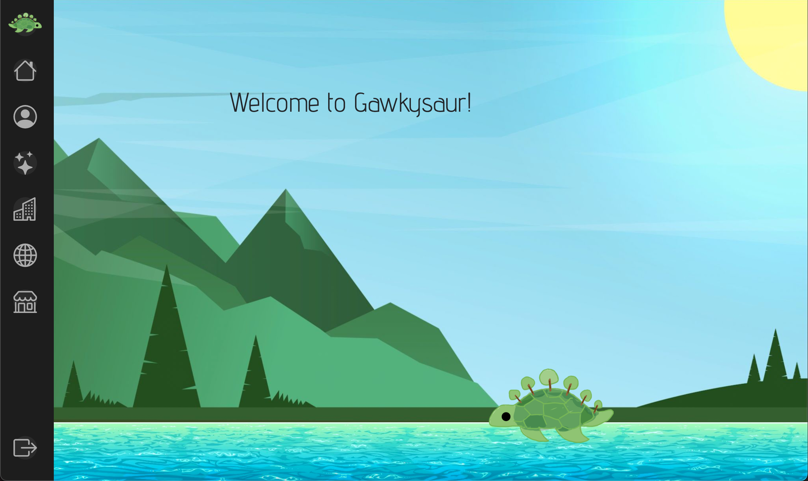
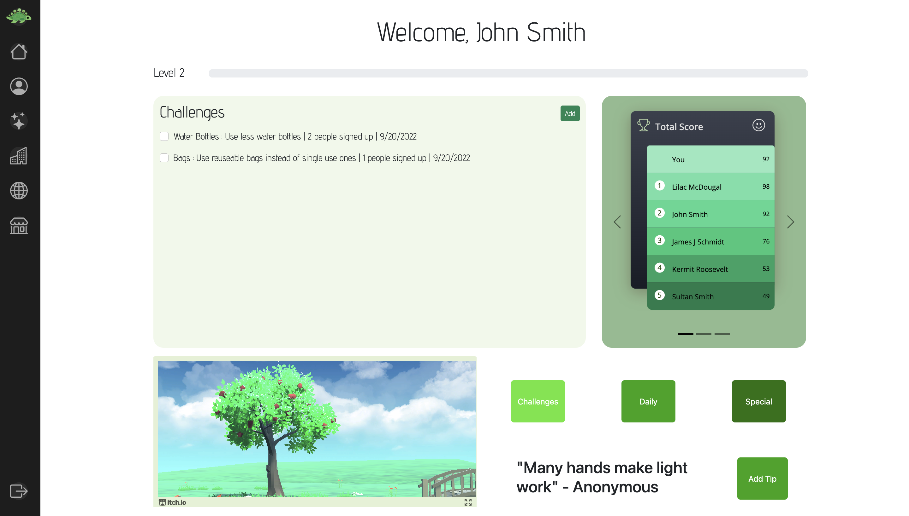
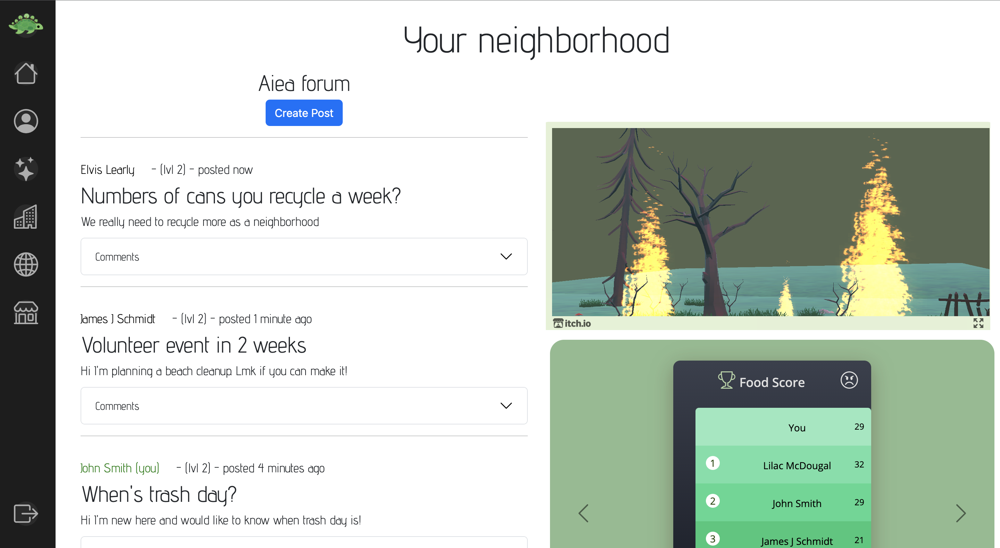
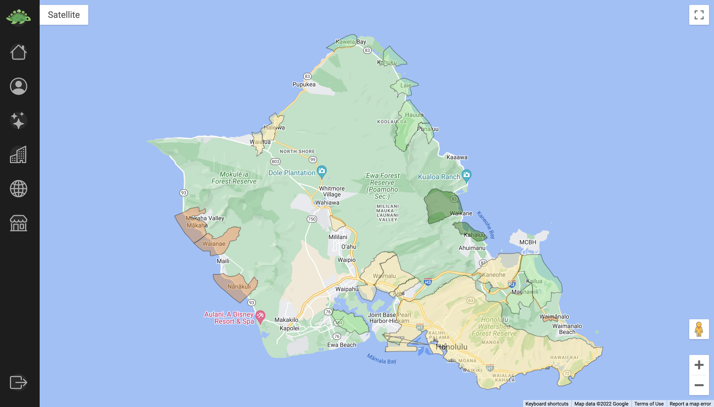
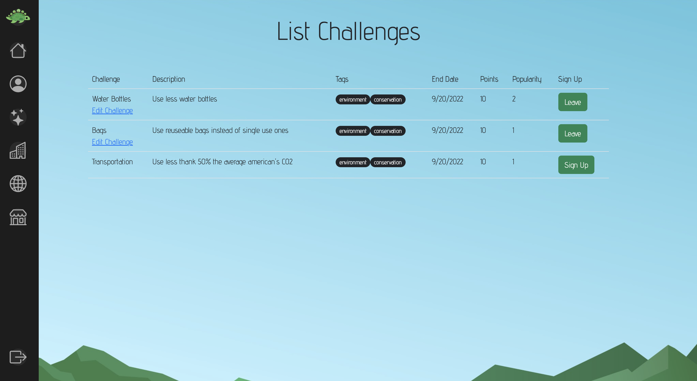
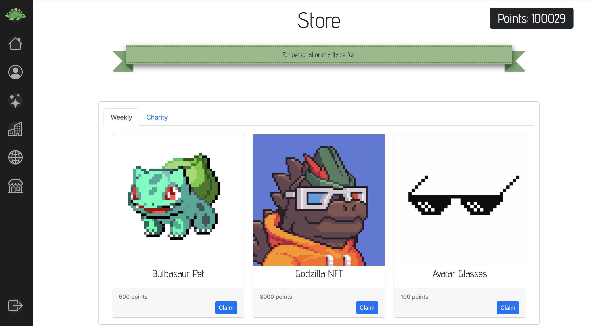
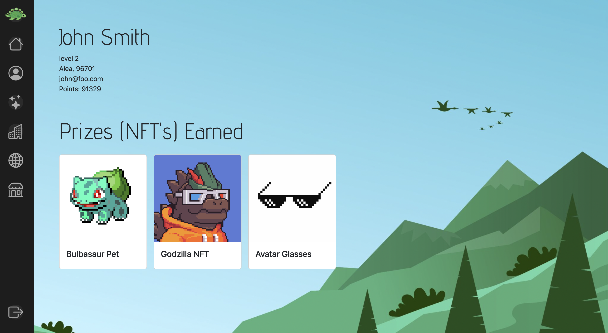

# Meteor Hackathon 2022: Team SUS-GAWKY
Stands for (Sus)tainability and our first name initials: Gavin, Alyssia, William, Kobey, Yong-Sung

We are creating a sustainability application that will make it more seemless to track how well you are doing compared to peers when it comes to being sustainable to our earth.

View our idea pitch on Youtube: https://youtu.be/no10E9VYg9s

Deployment: https://sus-gawky.meteorapp.com/

## Our Team
 - Kobey Arai - [LinkedIn](https://www.linkedin.com/in/kobey-arai-ba325a213/) - [Portfolio](https://kobeyarai.com/)
 - Alyssia Chen - [LinkedIn](http://linkedin.com/in/alyssia-chen-40024a204) - [Portfolio](https://alyssia-chen.github.io/)
 - William Liang - [LinkedIn](https://www.linkedin.com/in/william-liang808/) - [Portfolio](https://william-liang808.github.io/)
 - Yong-Sung Masuda - [LinkedIn](http://www.linkedin.com/in/yongsungm/) - [Portfolio](https://yongsungm.github.io/)
 - Gavin Peng - [LinkedIn](http://linkedin.com/in/gavin-peng-2b9046190/) - [Portfolio](https://devgav.github.io/)

## Our application pages

First off, our applications mascot is swimming in the waters of our landing page! 

This dashboard provides the user easy access to the challenges, check-in forms, and our means of using social comparison + social norm. In the bottom left is a Unity scene which changes based on the user's sustainability score. We believed that this image could show user's the impact of their decisions now on the future. On the top right are the rankings of various users in the application. Additionally, there's an emoji in the top right based on how well the user is doing because we read research about how a face can prompt action too.

To make people feel less isolated in their sustainability efforts, we aggregated people by their neighborhoods. Here, they can chat with their neighbors and also see the impact of their neighborhood on the world.

To give people a more global sense, we implemented a map where each neighborhood's aggregate score is displayed on the map. Specifically, it's visually color-coded so greener scores are better. For this hackathon, we showed this capability on the island of Oahu (where we live!).

To prompt more collaborative action, we created a "Challenge Page" which is where people can create challenges for other users to do with them.

When users check-in or complete challenges, they acquire points they can spend in the store. We believed that adding a gamification aspect would motivate people to use this application more and also be more sustainable.

On this page, the items that the user buys from the store are displayed here!

## We are using a Meteor App Template Project, here is more information on that template. 

For details, please see http://ics-software-engineering.github.io/meteor-application-template-react/
